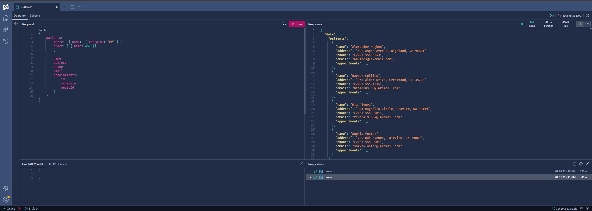

# GraphQL

-   Testing local: https://localhost:32791/graphql/
-   Testing on Docker: http://localhost:32790/graphql/



## Query Examples

### Sorting

<details>
    <summary>Collapse</summary>

-   Sorting by Name

    ```gql
    {
        medics(order: [{ name: ASC }]) {
            name
            medicalSpecialtyId
            appointments {
                schedule
            }
        }
    }
    ```

</details>

### Filtering

<details>
    <summary>Collapse</summary>

-   Filtering on name contains:

    ```gql
    {
        patients(where: { name: { contains: "ph" } }) {
            name
            address
            phone
            email
            appointments {
                id
                schedule
                medicId
            }
        }
    }
    ```

-   Filtering on name equals:
    ```gql
    {
        patients(where: { name: { eq: "Alexander Hughes" } }) {
            name
            address
            phone
            email
            appointments {
                id
                schedule
                medicId
            }
        }
    }
    ```

</details>

### Pagination

<details>
    <summary>Collapse</summary>

Managed to get it working by adding the `[UsePaging]` decorator only on the query - **Query.cs** - but on the models:

```csharp
...
[UsePaging]
[UseProjection]
[UseFiltering]
[UseSorting]
public IQueryable<Patient> GetPatients([Service] PostgreContext context) => context.Patients;
...
```

-   Getting the first 2 records:

    ```gql
      {
          // Ordered by name and getting 2 records
          // (I just have 5 records by the time I was running the code 😜)
          patients( order: [ { name: ASC }] first: 2) {
              edges {
                  node {
                      id
                      name
                  }
                  cursor                  // shows the cursor position of the current record
                  }
                  pageInfo {
                      hasNextPage         // boolean, indicates if a next page exists
                      hasPreviousPage     // boolean, indicates if a previous page exists
                      startCursor         // Indicates the value of the first cursor on the current query
                      endCursor           // Indicates the value of the last cursor on the current query
              }
          }
      }
    ```

    Response:

    ```json
    {
        "data": {
            "patients": {
                "edges": [
                    {
                        "node": {
                            "id": "b681485e-a062-4e71-9272-96e610e5bd36",
                            "name": "Alexander Hughes"
                        },
                        "cursor": "MA=="
                    },
                    {
                        "node": {
                            "id": "e916e089-3681-464f-9fe6-1cc522280800",
                            "name": "Harper Collins"
                        },
                        "cursor": "MQ=="
                    }
                ],
                "pageInfo": {
                    "hasNextPage": true,
                    "hasPreviousPage": false,
                    "startCursor": "MA==",
                    "endCursor": "MQ=="
                }
            }
        }
    }
    ```

-   Getting the next 2 records: Note the `after: "MQ=="` setted with the value of `endCursor`

    ```gql
    {
        patients(order: [{ name: ASC }], first: 2, after: "MQ==") {
            edges {
                node {
                    id
                    name
                }
                cursor
            }
            pageInfo {
                hasNextPage
                hasPreviousPage
                startCursor
                endCursor
            }
        }
    }
    ```

    Response:

    ```json
    {
        "data": {
            "patients": {
                "edges": [
                    {
                        "node": {
                            "id": "e5dcab66-2937-43ec-8976-0eac94cbd104",
                            "name": "Mia Rivera"
                        },
                        "cursor": "Mg=="
                    },
                    {
                        "node": {
                            "id": "1e58ace1-df38-4f32-b9ae-8f98f7375265",
                            "name": "Noah Reed"
                        },
                        "cursor": "Mw=="
                    }
                ],
                "pageInfo": {
                    "hasNextPage": true,
                    "hasPreviousPage": true,
                    "startCursor": "Mg==",
                    "endCursor": "Mw=="
                }
            }
        }
    }
    ```

-   Getting the previous 2 records: Note the `before: "Mg=="` setted with the value of `startCursor`

    ```gql
    {
        patients(order: [{ name: ASC }], first: 2, before: "Mg==") {
            edges {
                node {
                    id
                    name
                }
                cursor
            }
            pageInfo {
                hasNextPage
                hasPreviousPage
                startCursor
                endCursor
            }
        }
    }
    ```

    Response:

    ```json
    {
        "data": {
            "patients": {
                "edges": [
                    {
                        "node": {
                            "id": "b681485e-a062-4e71-9272-96e610e5bd36",
                            "name": "Alexander Hughes"
                        },
                        "cursor": "MA=="
                    },
                    {
                        "node": {
                            "id": "e916e089-3681-464f-9fe6-1cc522280800",
                            "name": "Harper Collins"
                        },
                        "cursor": "MQ=="
                    }
                ],
                "pageInfo": {
                    "hasNextPage": true,
                    "hasPreviousPage": false,
                    "startCursor": "MA==",
                    "endCursor": "MQ=="
                }
            }
        }
    }
    ```

</details>

## Mutation Examples

> I'm using a partial class, **Mutation.cs**, to separate the responsabilities for each entity.

> Also, I'm still using the UoW to persist the data.

### Adding a record

<details>
    <summary>Collapse</summary>

-   Adding a new patient (see **PatientMutation.cs**):

    ```gql
    mutation {
        addPatient(patientInput: { name: "Mason Ethan Fisher", address: "492 Birch Court, Bluewater, FL 56849", phone: "(208) 555-4851", email: "m.ethanF.FL@fakemail.com" }) {
            id
            name
        }
    }
    ```

-   Adding a new Medic:

    ```gql
    mutation {
        addMedic(medicInput: { name: "Harper Charlotte Brooks", address: "567 Willow Boulevard, Rosewood, GA 38374", email: "h.charlotte.brooks@fakemail.com", phone: "(256) 555-8429", medicalSpecialtyId: ["bc8d034d-7cdc-49d8-8bbb-09fbcb138c2f", "0e2e04b1-0fea-41f1-8515-7743401ca91f"] }) {
            id
            name
            address
        }
    }
    ```

    </details>

## Events Subscription

> I'm using a partial class, **Subscription.cs**, to separate the responsabilities for each entity.

### Subscription

#### MedicAdded event

<details>
    <summary>Collapse</summary>

The goal of the event is receive and return a `MedicResult` when a new one is created.

The event was created on the Subscription class, **MedicSubscription.cs** file:

```csharp
[Subscribe]
public MedicResult MedicAdded([EventMessage] MedicResult medic) => medic;
```

The event trigger was added on the Mutation class, **MedicMutation.cs** file, on the `AddMedic` method:

```csharp
public async Task<MedicResult> AddMedic(..., [Service] ITopicEventSender topicEventSender, ...)
{
    ...
    // Triggering the event
    await topicEventSender.SendAsync(nameof(Subscription.MedicAdded), medicResult);
    ...
}
```

-   Adding a new Medic:

    ```gql
    mutation {
        addMedic(medicInput: { name: "Harper Charlotte Brooks", address: "567 Willow Boulevard, Rosewood, GA 38374", email: "h.charlotte.brooks@fakemail.com", phone: "(256) 555-8429", medicalSpecialtyId: ["bc8d034d-7cdc-49d8-8bbb-09fbcb138c2f", "0e2e04b1-0fea-41f1-8515-7743401ca91f"] }) {
            id
            name
            address
        }
    }
    ```

-   Subscription to event example:

    ```gql
    subscription {
        medicAdded {
            id
            name
            address
            phone
            email
            medicalSpecialtyId
        }
    }
    ```

-   Subscription response when a new Medic is created:

    ```json
    {
        "data": {
            "medicAdded": {
                "id": "2458fc1a-590c-4e4f-a86b-6d78756bc2cc",
                "name": "Harper Charlotte Brooks",
                "address": "567 Willow Boulevard, Rosewood, GA 38374",
                "phone": "(256) 555-8429",
                "email": "h.charlotte.brooks@fakemail.com",
                "medicalSpecialtyId": ["bc8d034d-7cdc-49d8-8bbb-09fbcb138c2f", "0e2e04b1-0fea-41f1-8515-7743401ca91f"]
            }
        }
    }
    ```

</details>

#### MedicUpdated event

<details>
    <summary>Collapse</summary>

The goal of the event is watch the update of a specific Medic record by id.

The event was created on the Subscription class, **MedicSubscription.cs** file:

```csharp
[SubscribeAndResolve]
public ValueTask<ISourceStream<MedicResult>> MedicUpdated(Guid medicId, [Service] ITopicEventReceiver topicEventReceiver)
{
    string topicName = $"{medicId}_{nameof(Subscription.MedicUpdated)}";
    return topicEventReceiver.SubscribeAsync<MedicResult>(topicName);
}
```

The event trigger was added on the Mutation class, **MedicMutation.cs** file, on the `UpdateMedic` method:

```csharp
public async Task<MedicResult> UpdateMedic(..., [Service] ITopicEventSender topicEventSender, ...)
{
    ...
    // Triggering the event
    string updatedMedicTopic = $"{medicResult.Id}_{nameof(Subscription.MedicUpdated)}";
    await topicEventSender.SendAsync(updatedMedicTopic, medicResult);
    ...
}
```

-   Updating a Medic:

```gql
mutation {
    updateMedic(
        id: "2458fc1a-590c-4e4f-a86b-6d78756bc2cc"
        medicInput: { name: "AAAHarper Charlotte Brooks", address: "567 Willow Boulevard, Rosewood, GA 38374", phone: "(256) 555-8429", email: "h.charlotte.brooks@fakemail.com", medicalSpecialtyId: ["bc8d034d-7cdc-49d8-8bbb-09fbcb138c2f", "0e2e04b1-0fea-41f1-8515-7743401ca91f"] }
    ) {
        id
        name
    }
}
```

-   Subscription to `MedicUpdated` event:

Note that we are watching the following specific `medicId`. Any other Medic, with different id, won't be watched.

```gql
subscription {
    medicUpdated(medicId: "2458fc1a-590c-4e4f-a86b-6d78756bc2cc") {
        id
        name
        address
        phone
        email
        medicalSpecialtyId
    }
}
```

-   Subscription response when the specified Medic is updated:

```json
{
    "data": {
        "medicUpdated": {
            "id": "2458fc1a-590c-4e4f-a86b-6d78756bc2cc",
            "name": "AAAHarper Charlotte Brooks",
            "address": "567 Willow Boulevard, Rosewood, GA 38374",
            "phone": "(256) 555-8429",
            "email": "h.charlotte.brooks@fakemail.com",
            "medicalSpecialtyId": ["bc8d034d-7cdc-49d8-8bbb-09fbcb138c2f", "0e2e04b1-0fea-41f1-8515-7743401ca91f"]
        }
    }
}
```

</details>

## Caveats

<details>
    <summary>Collapse</summary>

-   [UseSorting] decorator on the models is causing execution errors.

```csharp
public class Medic
{
    [Key]
    public Guid Id { get; set; }
    [Required]
    public string Name { get; set; }
    public string Address { get; set; }
    [Phone]
    public string Phone { get; set; }
    [EmailAddress]
    public string Email { get; set; }

    [Required]
    //[UseSorting] // Execution errors
    [ForeignKey(nameof(MedicalSpecialty))]
    public List<Guid> MedicalSpecialtyId { get; set; }

    [JsonIgnore]
    //[UseSorting] // Execution errors
    public List<Appointment> Appointments { get; } = new();

}
```

-   `.RegisterDbContextFactory()` on **Program.cs** is causing execution errors.

```csharp
...
builder.Services.AddGraphQLServer().AddQueryType<Query>()
                                   //.RegisterDbContextFactory<PostgreContext>() // Execution errors
                                   .AddProjections()
                                   .AddFiltering()
                                   .AddSorting();
...
```

</details>
