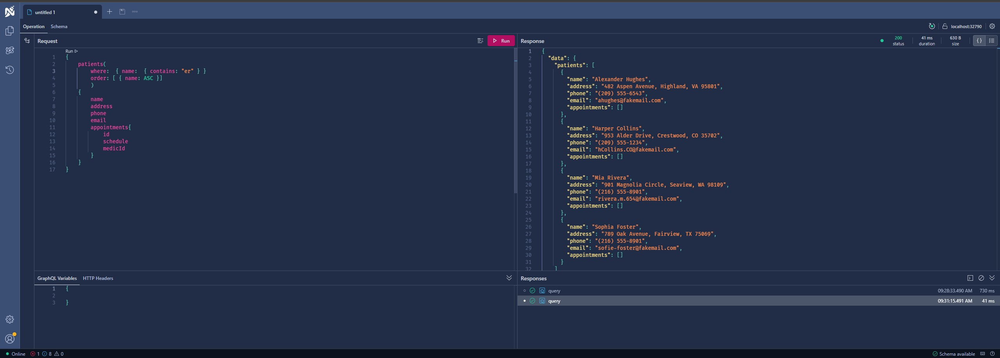

# GraphQL

-   Testing local: https://localhost:32791/graphql/
-   Testing on Docker: http://localhost:32790/graphql/



## Query Examples

-   Sorting by Name

    ```json
    {
        medics(order: [ {name: ASC} ])
        {
            name
            medicalSpecialtyId
            appointments {
                schedule
            }
        }
    }
    ```

-   Filtering

    ```json
    {
        patients(where:  { name:  { contains: "ph" } })
        {
            name
            address
            phone
            email
            appointments{
                id
                schedule
                medicId
            }
        }
    }
    ```

    ```json
    {
        patients(where:  { name:  { eq: "Alexander Hughes" } })
        {
            name
            address
            phone
            email
            appointments{
                id
                schedule
                medicId
            }
        }
    }
    ```

## Caveats

-   [UseSorting] decorator on the models is causing execution errors.

```csharp
public class Medic
{
    [Key]
    public Guid Id { get; set; }
    [Required]
    public string Name { get; set; }
    public string Address { get; set; }
    [Phone]
    public string Phone { get; set; }
    [EmailAddress]
    public string Email { get; set; }

    [Required]
    //[UseSorting] // Execution errors
    [ForeignKey(nameof(MedicalSpecialty))]
    public List<Guid> MedicalSpecialtyId { get; set; }

    [JsonIgnore]
    //[UseSorting] // Execution errors
    public List<Appointment> Appointments { get; } = new();

}
```

-   `.RegisterDbContextFactory()` on **Program.cs** is causing execution errors.

```csharp
...
builder.Services.AddGraphQLServer().AddQueryType<Query>()
                                   //.RegisterDbContextFactory<PostgreContext>() // Execution errors
                                   .AddProjections()
                                   .AddFiltering()
                                   .AddSorting();
...
```
